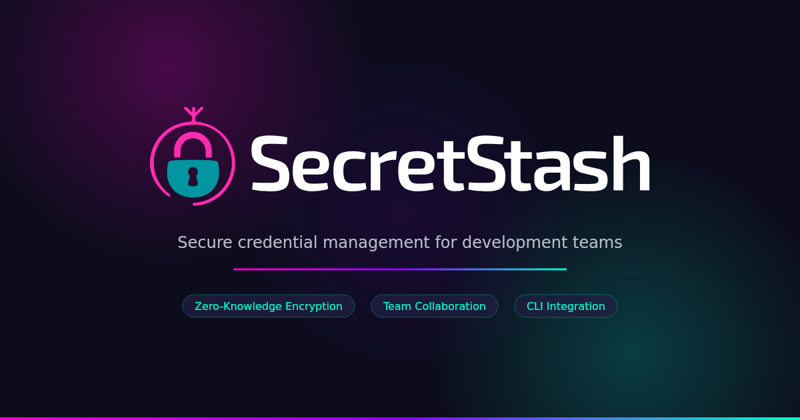

# SecretStash Node Package

[](https://www.npmjs.com/package/@secret-stash/cli)
[](https://www.npmjs.com/package/@secret-stash/cli)
[](https://github.com/dniccum/secret-stash-node/actions/workflows/ci.yml)
[](https://github.com/dniccum/secret-stash-node/actions/workflows/security.yml)
[](https://github.com/dniccum/secret-stash-node/actions/workflows/publish.yml)
[](LICENSE.md)

A Node.js/TypeScript package for interacting with the [SecretStash](https://secretstash.cloud) REST API. This package can be used as a programmatic Node module within a project or installed globally as a CLI tool. It provides full zero-knowledge encryption support for managing your environment variables.

## Requirements

- Node.js 18 or higher
- A SecretStash API Key

## Installation

### As a project dependency

```bash
npm install @secret-stash/cli --save
```

### As a global CLI

```bash
npm install -g @secret-stash/cli
```

Or run directly without installing:

```bash
npx @secret-stash/cli --help
```

> [!IMPORTANT]
> This package creates a `~/.secret-stash` directory on your machine (or the path specified by the `SECRET_STASH_KEY_DIR` environment variable). Ensure this folder is secure as it contains the keys required to decrypt your environment variables.

## Configuration

Add the following environment variables to your application's `.env` file:

```dotenv
SECRET_STASH_API_TOKEN=your_token_here
SECRET_STASH_APPLICATION_ID=your_application_id_here
```

- **API Key**: Create a token in SecretStash by navigating to your profile settings and accessing the "Tokens" tab.
- **Application ID**: Create or select an application in SecretStash and copy its ID from the dashboard.

> [!NOTE]
> Both the API key and Application ID are required. The package will throw an error if either is missing.

## Quick Example

Pull your environment's variables from SecretStash into your local `.env` file:

```bash
secret-stash variables pull -e production
```

Push your local `.env` variables to SecretStash:

```bash
secret-stash variables push -e production
```

Switch between applications using the `--application` flag:

```bash
secret-stash -a <app-id> variables list -e production
```

For the full list of available commands, options, and programmatic usage, visit the [SecretStash Node documentation](https://docs.secretstash.cloud/node-package/commands).

## Testing

```bash
npm test
```

## Contributing

Please see [CONTRIBUTING](CONTRIBUTING.md) for details.

## Credits

- [Doug Niccum](https://github.com/dniccum)
- [All Contributors](../../contributors)

## License

The MIT License (MIT). Please see [License File](LICENSE.md) for more information.
